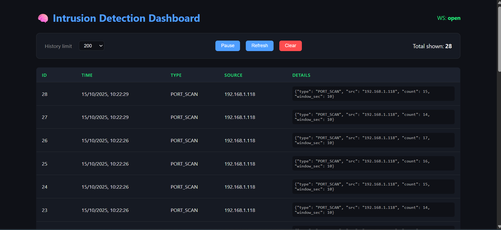
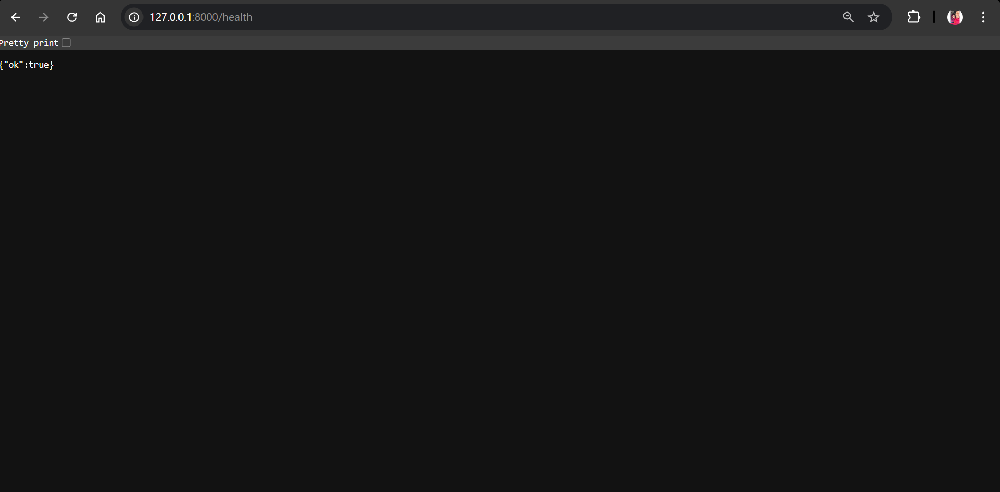

#  Intrusion Detection System (IDS-Pro)

A **real-time network intrusion detection system** built with **FastAPI**, **Scapy**, **React**, and **SQLite**.  
It captures live packets, detects suspicious behavior such as **port scans**, and streams alerts instantly to a modern web dashboard.

---

##  Features
-  **Real-time packet capture** using Scapy  
-  **Port scan detection** (threshold-based)  
-  **FastAPI backend** with WebSocket live alerts  
-  **SQLite** database for persistent alert storage  
-  **React dashboard** with pause, refresh, and clear controls  
-  Responsive dark-themed interface  
 

---

##  Tech Stack

| Layer | Technology |
|--------|-------------|
| **Backend** | FastAPI, Scapy, SQLAlchemy, Uvicorn |
| **Frontend** | React (Vite), Fetch API, WebSockets |
| **Database** | SQLite |
| **Language** | Python 3.13, JavaScript (ES6+) |
---

##  Screenshots

### Live Alerts in Action  

### System Status & Health Endpoint  

---

